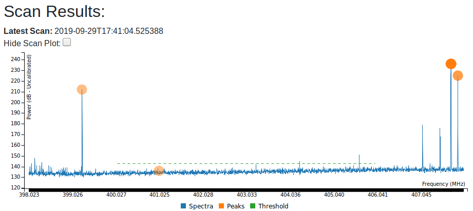

# spyserver_client
CLI spyserver client to provide basic rtl_sdr and rtl_power-like outputs from an Airspy spyserver.

Currently Linux-only.

This project is currently in ALPHA status. Feedback welcome.

Still new at this so if I'm breaking conventions or etiquette please let me know.

Usage:
```
Usage: ./ss_client [-options] <mode> [iq_outfile] [fft_outfile]

  mode: one of  iq | fft | both
  -f <center frequency>
  -s <sample_rate>
  [-j <digital gain> - experimental, 0.0 .. 1.0]
  [-e <fft resolution> default 100Hz target]
  [-g <gain>]
  [-i  <integration interval for fft data> (default: 10 seconds)]
  [-r <server>]
  [-q <port>]
  [-n <num_samples>]
  [<iq outfile name>] ( '-' for stdout; optional, but must be specified if an fft outfilename is also provided)
  [<fft outfile name>] default log_power.csv
NB: invoke as 'ss_power' for fft-only use with rtl_power compatible command line options
    invoke as 'ss_iq' for iq-only use 

```

Examples:

Stream 16-bit signed complex samples at 78125sps with receiver gain of 18:
```
/ss_client iq -f 403000000 -s 78125 -g 18 - > data.bin
```

Collect spectrum power once for 5 seconds requesting ~800Hz resolution and a bandwidth of 78125Hz:
```
./ss_client fft -f 403000000 -s 78125 -1 -i 5 -e 800
```

Stream complex samples to sdtout and spectrum power to log_power.csv every 10s:
```
./ss_client both -f 403000000 -s 78125 -i 10 -e 800 - log_power.csv
```


----
Compatibility with radiosonde_auto_rx is improving...


